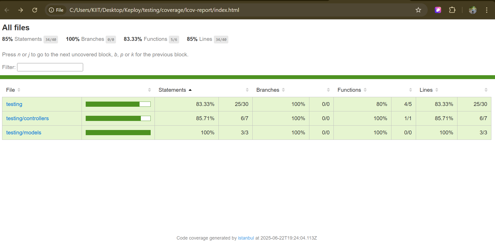

# 📚 Book Management API Server

This is a simple Book Management API built using **Node.js**, **Express**, and **MongoDB**, with comprehensive **unit**, **integration**, and **API testing** implemented using **Jest** and **Supertest**.

---

## 🔧 Features

- Create, Read, Update, Delete (CRUD) books.
- Connected to a MongoDB database (`BookStore`).
- Well-structured code with controllers, models, and routes.
- Fully tested with:
  - ✅ Unit Tests (with mocking)
  - ✅ Integration Tests (with live DB)
  - ✅ API Tests (with Supertest)

---

## 🚀 Tech Stack

| Layer            | Technology            |
|------------------|-----------------------|
| Server Framework | Express.js            |
| Database         | MongoDB (Localhost)   |
| ODM              | Mongoose              |
| Testing          | Jest, Supertest       |

---

## 📂 Folder Structure

```
/api-testing/
│
├── controllers/
│   └── bookController.js
├── models/
│   └── book.js
├── routes/
│   └── bookRoutes.js
├── tests/
│   ├── unit/
│   │   └── bookController.test.js
│   ├── integration/
│   │   └── dbIntegration.test.js
│   └── api/
│       └── bookAPI.test.js
├── app.js
├── server.js
├── package.json
└── jest.config.js
```

---

## ✅ How to Run Locally

### 1. Clone the Repository

```bash
git clone "repo URL"
cd book-api
```

### 2. Install Dependencies

```bash
npm install
```

### 3. Start MongoDB Server

Ensure MongoDB is running locally on:

```
mongodb://localhost:27017/BookStore
```

### 4. Run the Server

```bash
node server.js
```

The server will start at: [http://localhost:3000](http://localhost:3000)

---

## 🧪 Run Tests

```bash
npx jest --coverage
```

---

## 📸 Test Coverage Screenshot

```
/screenshots/coverage.png
```

Then link it here:



---

## 📊 Test Coverage Summary

| Type        | Status |
|-------------|--------|
| ✅ Statements | 85%    |
| ✅ Lines      | 85%    |
| ✅ Branches   | 100%   |
| ✅ Functions  | 83.33% |


> ✅ Achieved minimum 70% coverage  

---

## 🧪 Testing Frameworks Used

- [x] **Jest** – for all types of tests
- [x] **Supertest** – for HTTP request testing
- [x] **Mocking** – used for isolated unit testing

---

## 🙌 Contributed By

**Harshit Kumar Singh**  
[GitHub](https://github.com/HarshittSinghh) • [LinkedIn](https://www.linkedin.com/in/harshit-kumar-singh-46511022b/)

---

## 📝 Notes

- Ensure MongoDB is running before running tests.
- Avoid multiple calls to `mongoose.connect()` in tests.
- Use `afterAll()` to clean up database connections and avoid memory leaks.

---

## 📤 Submission Info (Keploy)

- ✅ Completed all 3 types of tests
- ✅ Achieved >70% code coverage
